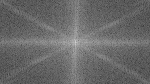

# Image Processing in the Frequency Domain: A Practical Guide

This `README` serves as a consolidated guide to the concepts and practical implementation of the Fourier Transform for image analysis, based on the provided study materials on Digital Image Processing.

*Bibliography*: Gonzalez, R.C. and Woods, R.E. (2018) Digital Image Processing. 4th Edition, Pearson Education.

## 1. Overview: Spatial Domain vs. Frequency Domain

An image can be represented in two primary domains:

* **Spatial Domain**: This is the standard representation where an image is a matrix of pixels, with each pixel holding an intensity value at a specific (x, y) coordinate.
* **Frequency Domain**: This representation describes the image in terms of its frequency components, showing the rate at which pixel intensities change.
The **Fourier Transform** is the mathematical tool that allows us to switch between these two domains.

## 2. The Fourier Transform in Images

The Fourier Transform decomposes an image into a sum of sines and cosine waves of varying frequencies, amplitudes, and phases. In an image, these frequencies represent:

* **Low Frequencies**: Correspond to slow and smooth changes in intensity, such as large, uniform areas of color. In the Fourier spectrum, these components are located **near the center**.
* **High Frequencies**: Correspond to abrupt and rapid changes in intensity, such as edges, fine details, textures, and noise. In the spectrum, they are located in the **outer regions**.

### 2.1. The 2D Discrete Fourier Transform (DFT)

For digital images, which are discrete, we use the Discrete Fourier Transform (DFT). The 2D DFT for an $M \times N$ image is typically computed using the **separability** property:

1.  A 1D DFT is computed for each **row** of the image.
2.  Then, a 1D DFT is computed for each **column** of the intermediate result.

The formula for the 1D DFT of a sequence with M samples, $f(x)$, is:
$$F(u) = \sum_{x=0}^{M-1} f(x) e^{-j2\pi ux/M}$$
where `u` is the frequency variable.

DFT and Inverse DFT Formulas

The forward and inverse 1D DFT for a sequence of M samples are defined as:

**Forward DFT**: $F(u) = \sum_{x=0}^{M-1} f(x) e^{-j2\pi ux/M}$ 

**Inverse DFT**: $f(x) = \frac{1}{M} \sum_{u=0}^{M-1} F(u) e^{j2\pi ux/M}$ 

The key differences are the **sign of the exponent** and the **normalization factor `1/M`** in the inverse transform.

### 2.2 How to understand DFT images
The brightest point, typically shifted to the **center** for visualization, **is the DC component** (frequency zero). It represents the **average brightness of the entire image**. The areas immediately surrounding the center correspond to the low frequencies.
#### Examples
* Segmented area

* Vertical and Diagonal borders

* Moon 

As you **move away from the center** towards the edges of the DFT image, you are observing the **higher frequencies**.

What they represent: These correspond to abrupt, rapid changes in pixel intensity. This is where you find the image's "action":

* Edges and Contours: The sharp transition between an object and its background.

* Fine Details and Textures: Complex patterns like fabric weaves, hair, or foliage.

* Noise: Random, high-frequency variations in the image often appear as scattered light points in the outer regions.

**Observation**: An image with a lot of sharp details, text, or texture will have a brighter and more spread-out pattern in its outer regions.

#### Patterns and Orientations 

The structure and orientation of bright spots in the spectrum reveal the geometry of the original image. **Strong, repetitive patterns in the original image create distinct, bright spots or lines in the spectrum.**

A key observation is the relationship between orientation:

* **A set of strong horizontal lines in the original image will create a bright vertical line in its spectrum.**

* Conversely, **strong vertical patterns create a horizontal line in the spectrum.**

Essentially, by analyzing where the "light" is in the DFT image—whether it's clustered at the center, spread out, or aligned in specific directions—you can deduce the structural characteristics of the original image without even looking at it. This is the basic for frequency-domain filtering because once we have the Frequency domain of the image we can set the frequencies we want to increase and the ones we want to reduce on the original image.

## 3.0 Filters
Filtering in the frequency domain leverages the Convolution Theorem, which states that convolution in the spatial domain is **equivalent to element-wise multiplication in the frequency domain** .

The process is:
* Transform the image to the frequency domain (F).
* Create a filter mask H of the same size.
* Multiply them: G = F * H.
* Apply the inverse transform to G to get the filtered image.

The radius is the **cutoff frequency parameter** you must tune based on the image size and desired effect. A small radius in a low-pass filter results in heavy blurring, while a large radius results in subtle smoothing.

### 3.1 High-Pass Filters
A high-pass filter does the opposite of a low-pass filter: it preserves high frequencies while attenuating low frequencies. This is useful for sharpening an image and enhancing fine details and edges.

The mask for a high-pass filter has values of 0 in the center and 1 towards the edges. The result is an image where smooth areas become darker and edges and textures become brighter and more prominent.
### 3.2 Low-Pass Filters
A low-pass filter preserves low frequencies while attenuating high frequencies. Since high frequencies correspond to sharp transitions like edges and noise, this filter has a smoothing or blurring effect on the image.

The mask for a low-pass filter typically has values of 1 in the center (where low frequencies are) and fades to 0 towards the edges (where high frequencies are). A common example is a circular mask, where the radius defines the "cutoff frequency"; a smaller radius results in more aggressive blurring.
### 3.3 Band-Pass Filters
A band-pass filter preserves frequencies within a specific range or "band," while attenuating frequencies that are lower or higher than this range. This type of filter is useful for isolating features of a particular scale or size, such as specific textures in an image.

The mask for a band-pass filter looks like an annulus or ring, with values of 0 in the center and at the far edges, and values of 1 within the ring. This allows only the intermediate frequencies to pass through.
