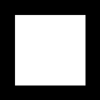

# Morphology in Digital Image Processing
This document provides an overview of fundamental and compound morphological operations for image analysis, based on the principles of mathematical morphology. Morphology is a non-linear technique used to process images based on their shapes. It is a powerful tool for extracting image components that are useful for shape representation and description, such as boundaries, skeletons, and convex hulls. 

Morphology is a set of image processing operations that process images based on shapes. It is commonly applied to binary images but can also be used on grayscale images. Morphological techniques use a structuring element to probe and transform the input image.

## Common Morphological Operations

- **Erosion**: Removes pixels on object boundaries, making objects thinner and eliminating small details.
- **Dilation**: Adds pixels to object boundaries, making objects larger and filling small holes.
- **Opening**: Erosion followed by dilation; removes small objects or noise from the foreground.
- **Closing**: Dilation followed by erosion; fills small holes and gaps in the foreground objects.
- **Morphological Gradient**: The difference between dilation and erosion, highlighting object edges.
- **Top-hat Transform**: Extracts small elements and details from images.
- **Black-hat Transform**: Reveals small holes and dark regions on a bright background.

## Set theory

The foundation of mathematical morphology is set theory. In this context, objects within a binary image are treated as sets, where each element is a coordinate pair (x, y) corresponding to a foreground pixel.  All morphological operations are therefore based on set logic.

## Structuring Element

A structuring element is a small shape or template used to interact with the image. Common shapes include squares, disks, and crosses. The choice of structuring element affects the outcome of morphological operations.

## Fundamental operations

### Dilation
Dilation is an operation that **expands or thickens** the foreground objects in an image. It is defined as:
$$A\oplus B=\{z|(\hat{B})_{z}\cap A\ne\emptyset\}$$
The structuring element `B` is passed over the image `A`. [cite_start]The result is the set of all points where the reflected SE has a non-empty intersection with the original object[cite: 690]. Intuitively, it adds pixels to the boundaries of objects.


**Primary Use Case**: Dilation is commonly used for **bridging gaps** in an object that may have resulted from poor resolution or noise.

### Erosion
Erosion is the dual operation to dilation; it **shrinks or thins** foreground objects. It is defined as:
$$A\ominus B=\{z|(B)_{z}\subseteq A\}$$


The result is the set of all points where the structuring element `B` can fit completely inside the original object `A`. Erosion effectively strips away a layer of pixels from the boundaries of objects.

**Primary Use Case**: Erosion is used to **remove small, irrelevant components** or noise from an image.

# Compound Operations

By combining dilation and erosion, we can create more powerful and less destructive operations for image cleaning and feature extraction.

### Opening
The opening operation is defined as an **erosion followed by a dilation** using the same structuring element.
$$A\circ B=(A\ominus B)\oplus B$$


Opening generally **smoothes the contours** of an object, **breaks thin connections**, and **eliminates small islands** of pixels (often called "salt" noise). It is considered **less destructive than a simple erosion** because the subsequent dilation helps to restore the shape of the larger objects that survived the erosion.

### Closing
The closing operation is the dual of opening, defined as a **dilation followed by an erosion**.
$$A\bullet B=(A\oplus B)\ominus B$$


Closing also tends to smooth contours but is primarily used to **fuse narrow breaks**, fill long, thin gulfs, and **eliminate small holes** within objects ("pepper" noise). **It is less destructive than a simple dilation**.


# Hit or miss
The morphological hit-or-miss transform (HMT) is a basic tool for shape detection.
Let I be a binary image composed of foreground (A) and background pixels, respectively.
the HMT utilizes two structuring elements: B1, for detecting shapes in the foreground, and B2 , for detect-
ing shapes in the background. The HMT of image I is defined as
$$A\otimes B=(A\ominus B_{1})\cap(A^{c}\ominus B_{2})$$

**B1 found a match in the foreground** (i.e., B1 is contained in A) and **B2 found a match in the background** (i.e., B2 is contained in Ac ). The word “simultaneous” implies that z is the same translation
of both structuring elements. The word “miss” in the HMT arises from the fact that B2 finding a match in Ac is the same as B2 not finding (missing) a match in A

**A match is found only at locations where the "Hit" kernel fits perfectly within the foreground of the image **AND** the "Miss" kernel fits perfectly within the background of the image at the same time.**
* In erosion only the 1's in the kernel should match the 0's doesn't matter

## Example border detection with hit or miss
For kernels:
```python
hit_kernel = np.array([[1, 0, 0],
                        [1, 0, 0],
                        [1, 0, 0]], dtype=np.uint8) 

miss_kernel = np.array([[0, 0, 1],
                        [0, 0, 1],
                        [0, 0, 1]], dtype=np.uint8) 
```


# Boundary Extraction
The boundary of a set A of foreground pixels, denoted by $\beta(A)$ can be obtained by
**first eroding A by a suitable structuring element B, and then performing the set difference between A and its erosion**. That is:

$\beta(A) = A - (A \ominus B)$


## Top-Hat Transform

The Top-Hat transform is defined as the difference between an original image and its morphological opening.

* **Formula**: `Top-hat = Original Image - Opening(Image)` 
* Primary Application: It is highly effective for **extracting light objects from an unevenly illuminated dark background**, a common problem known as shading correction.

## Bottom-Hat Transform

The Bottom-Hat transform is the dual of the Top-Hat. It is defined as the difference between the morphological closing of an image and the original image itself.

* **Formula**: `Bottom-hat = Closing(Image) - Original Image`
* Primary Application: **It is used to extract dark objects or details situated on a bright background**.

# Hole filling algorithm
A hole may be defined as a background region surrounded by a connected border of foreground pixels.
Let A denote a set whose elements are 8-connected boundaries, with each boundary enclosing a background region (i.e., a hole). Given a point in each hole, the objective is **to fill all the holes with foreground elements (1’s)**. 

1. We begin by forming an array, $X_{0}$ , of 0’s or background (the same size as I, the image containing A), except at locations in $X_{0}$ that correspond to pixels that are known to be holes (**Its not necessary to know all the pixels that belongs to the hole, just a marker that is in every hole is enough**), which we set to 1. 
2. Then, the following procedure fills all the holes with 1’s:

$X_{k}=(X_{k-1}\oplus B)\cap A^{c}$

3. The algorithm terminates at iteration step k if $X_{k}=X_{k-1}$. Then, $X_k$ contains all the filled holes. The set union of $X_k$ and **I** contains all the filled holes and their boundaries. 

* The dilation would fill the entire area if left unchecked, but the
intersection at each step with $Ic$ limits the result to inside the region of interest.

Orinal image generated with OpenCV:

```python
    cv.rectangle(test_image, (30, 30), (170, 170), 255, -1) # External Square
    cv.rectangle(test_image, (70, 70), (130, 130), 0, -1)   # Internal Hole
```


Image after applied the hole filling algorithm



# Convex Hull

A set, S, of points in the Euclidean plane is said to be convex **if and only if a straight line segment joining any two points in S lies entirely within S. The convex hull, H, of S is the smallest convex set containing S.**
he process is as follows:

1. **Structuring Elements**: The algorithm uses a set of structuring elements (typically four, denoted B¹, B², B³, B⁴), each designed to fill concavities from a specific direction.

* Notice that the structuring elements are not selectable by the user ( are not parameters in the method). The SE are fixed as it follows:
```python
# x stands for doesnt matter
    B1 = [[1, x, x],
          [1, 0, x],
          [1, x, x]]
    
    B2 = [[1, 1, 1],
          [x, 0, x],
          [x, x, x]]

    B3 = [[x, x, 1],
          [x, 0, 1],
          [x, x, 1]]
    
    B4 = [[x, x, x],
          [x, 0, x],
          [1, 1, 1]]

```

2. **Initialization**: The process begins with a copy of the original image `A` for each structuring element. This is iteration zero: $X_{0}^{i}=A$.

3. **Iterative Process**: For each structuring element `Bⁱ`, the following formula is applied repeatedly until no further changes occur:

    $X_{k}^{i}=(X_{k-1}^{i}\otimes B^{i})\cup A$.
    * The `⊗` operation **is a process similar to the Hit-or-Miss transform that expands the object**.
    * The **union** with the original image `A` (`∪ A`) is crucial; it ensures that the original object is always contained within the result and that growth only occurs in the concave regions.

4. **Convergence**: The iteration for each process `i` stops when the result no longer changes, i.e., when $X_{k}^{i}=X_{k-1}^{i}$. The converged result for each process is then stored as $D^{i}$.

5. **Final Result**: The complete Convex Hull, `C(A)`, is the **union** of the four converged results: 
    $C(A)=\bigcup_{i=1}^{4}D^{i}$.


This method combines the fillings from all directions to form the final convex hull of the object.

# Advanced Morphological Algorithms

This section details advanced morphological algorithms that build upon the fundamental operations of erosion and dilation. These techniques are used for sophisticated shape analysis, simplification, and feature extraction.


## Thinning

Thinning is a morphological operation used to remove selected foreground pixels from binary images. The goal is to reduce objects to lines of single-pixel width while preserving their essential structure, such as endpoints and connectivity. It is an iterative process that typically uses a sequence of rotating structuring elements from the Hit-or-Miss transform. Each SE is designed to remove pixels from a certain boundary direction without breaking the object. The operation for a single structuring element B is defined as the set difference between the original set A and the result of the HMT:

$$A\otimes B=A-(A\otimes B)$$


**Primary Use Case**: Thinning is used to obtain a simplified, skeleton-like representation of a shape, often as a precursor to feature extraction or object recognition.


## Thickening

Thickening is the morphological dual of thinning and is used to grow selected foreground pixels, making objects thicker. In practice, thickening is often performed by thinning the background (the complement of the image) and then taking the complement of the result. The formal operation is defined as the union of the original set A with the result of the Hit-or-Miss transform:

$$A\odot B=A\cup(A\otimes B)$$


**Primary Use Case**: It is used for growing regions or filling small gaps to reinforce object connectivity.


## Skeletons

The skeleton of a shape is a thin version of that shape that is equidistant from its boundaries, also known as its medial axis. It provides a compact and essential representation of the object's structure. A key feature is that the original object can be perfectly reconstructed from its skeleton subsets. The skeleton can be calculated via a series of erosions and openings. The formula for the k-th subset of the skeleton is:

$$S_{k}(A)=(A\ominus kB)-((A\ominus kB)\circ B)$$


Where $(A\ominus kB)$ represents k successive erosions of A by B.

**Primary Use Case**: Skeletons are used for shape analysis, feature extraction, and object recognition, as they simplify a complex shape to its core components.


## Pruning

Pruning is a morphological operation used to clean up the results of thinning or skeletonization. It works by identifying and removing small, parasitic branches ("spurs") from the skeleton lines without altering the overall structure. This is typically achieved by finding the endpoints of lines and then applying a sequence of morphological operations, such as conditional dilation, to remove short branches connected to them.


**Primary Use Case**: To refine skeletons and thinned representations for more accurate shape analysis.


## Image Reconstruction

Morphological reconstruction is an iterative process where a "marker" image is repeatedly dilated, but its expansion is constrained by a "mask" image. This technique allows shapes from the marker image to propagate, but only within the boundaries defined by the mask. The core iterative step is:

$$h_{k+1}=(h_{k}\oplus B)\cap G$$


The process stops when the shape can no longer grow (when $h_{k+1}=h_k$).


**Primary Use Case**: It has several advanced applications, including robust hole filling, clearing objects touching the image border, and "opening by reconstruction," which removes small objects without distorting the shape of the remaining ones.

## Applications

- Noise removal
- Object extraction
- Image segmentation
- Shape analysis
- Edge detection
- Skeletonization
- Feature extraction


