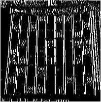

## Funtamental of image segmentation 
Let R represent the entire spatial region occupied by an image. We may view image
segmentation as a process that partitions R into n subregions, the segmentation process can be based on **discontinuity or similarity**.

---
### Similarity or Region-based segmentation

*about the similarity* we have the region-base segmentation as it follows; $R_{1}, R_{2},..., R_{n}$ such
that: 

(a) $$ \bigcup_{i=1}^{n} R_i = R. $$

(b)  $$ R_i, \text{is a connected set, for}\space  i = 0, 1, 2, \ldots, n $$

(c)  $$ R_i \cap R_j = \varnothing \quad \text{For all } i \text{and } j, \, i \ne j. $$

(d) $$ Q(R_i) = \text{TRUE} \quad \text{for } i = 0, 1, 2, \ldots, n $$

(e)  $$ Q(R_i \cup R_j) = \text{FALSE} \quad \text{For any adjacent regions } R_i \text{ and } R_j. $$

* If the set formed by the union of two
regions is not connected, the regions are said to **disjoint**.

Condition **(a)** indicates that the segmentation must be complete, in the sense that **every pixel must be in a region**. 

Condition **(b)** requires that **points in a region be connected in some predefined sense** (e.g., the points must be 8-connected). 

Condition **(c)** says that **the regions must be disjoint.** 

Condition **(d)** deals with the properties that must be satisfied by the pixels in a segmented region for example, $Q(R_{i}) = TRUE$
if all pixels in $R_{i}$ have the same intensity. 

Finally, condition **(e)** indicates that **two adjacent regions $R_{i}$ and $R_{j}$ must be different in the sense of predicate** Q.† (Transpose)

* **VERY IMPORTANT DEFINITION**: The **logical predicate Q** is an homogeneous rule that defines what makes the pixels in a region similar based on similarities criteria such as " All the pixels in $R_{i}$ must have the same intensity value " 

---
### Discontinuity or Edge-base segmentation 
This type of segmentation follows implement a detection based on local discontinuities on an image.

Prior to that we need to introduce the types of discontinuities we can have in an image. The three types of image characteristics in which we are interested are isolated points, lines, and edges.

* **Edge** pixels are pixels at which
the intensity of an image changes abruptly.
* A **line** may be viewed as a (typically) thin edge segment in which the intensity of the background on either side of the line is either much higher or much lower than the intensity of the line
pixels.
* An **isolated point** may be viewed as a foreground (background) pixel surrounded by background (foreground) pixels. 

$ \rightarrow $ It is intuitive that **abrupt, local changes in intensity can be detected using derivatives.** For reasons that will become evident shortly, first- and
second-order derivatives are particularly well suited for this purpose.

In what follows, we compute *intensity differences* using just a few terms of the Taylor
series. For first-order derivatives we use only the linear terms, and we can form differences in
one of three ways.

---

**The forward difference**:

$$
\frac{\partial f(x)}{\partial x} = f'(x) = f(x + 1) - f(x)
$$
 
**The backward difference** :

$$
\frac{\partial f(x)}{\partial x} = f'(x) = f(x) - f(x - 1)
$$

**the central difference** :

$$
\frac{\partial f(x)}{\partial x} = f'(x) = \frac{f(x + 1) - f(x - 1)}{2}
$$

**The second order derivative** based on a central difference,  
$\dfrac{\partial^2 f(x)}{\partial x^2}$, is obtained by:

$$
\frac{\partial^2 f(x)}{\partial x^2} = f''(x) = f(x + 1) - 2f(x) + f(x - 1)
$$

**Points are detected based on the Laplacian:**

$$
\nabla^2 f(x, y) = \frac{\partial^2 f(x, y)}{\partial x^2} + \frac{\partial^2 f(x, y)}{\partial y^2}
$$

$$
\nabla^2 f(x, y) = f(x+1, y) + f(x-1, y) + f(x, y+1) + f(x, y-1) - 4f(x, y)
$$

---
$ \rightarrow $ **Conclusion**: In summary, we arrive at the following conclusions: 

(1) **First-order derivatives generally produce thicker edges**. 

(2) Second-order derivatives have a **stronger response to
fine detail, such as thin lines, isolated points, and noise**. 

(3) Second-order derivatives produce a double-edge response at ramp and step transitions in intensity. 

(4) The **sign of the second derivative** can be used to determine whether a **transition into** an edge is from** light to dark or dark to light.**

To find derivatives we scan the image using a mask: The approach of choice for computing first and second derivatives at every pixel location in an image is to use spatial convolution. For the 3x3 filter kernel, the procedure is to compute the sum of products of the kernel coefficients with the intensity values in the region encompassed by the kernel

$$
Z = w_1 z_1 + w_2 z_2 + \dots + w_9 z_9 = \sum_{k=1}^{9} w_k z_k
$$

Considering the original image: 


###  **Point** Extraction kernels

These masks can be implemented as follows:

| (a) | (b) | (c) | (d) |
|:---:|:---:|:---:|:---:|
| $\begin{bmatrix} 0 & 1 & 0 \\ 1 & -4 & 1 \\ 0 & 1 & 0 \end{bmatrix}$ | $\begin{bmatrix} 1 & 1 & 1 \\ 1 & -8 & 1 \\ 1 & 1 & 1 \end{bmatrix}$ | $\begin{bmatrix} 0 & -1 & 0 \\ -1 & 4 & -1 \\ 0 & -1 & 0 \end{bmatrix}$ | $\begin{bmatrix} -1 & -1 & -1 \\ -1 & 8 & -1 \\ -1 & -1 & -1 \end{bmatrix}$ |

**Descriptions:**
- (a) Filter mask used to implement.  
- (b) Mask used to implement an extension of this equation that includes the diagonal terms.  
- (c) and (d) Two other implementations of the Laplacian found frequently in practice.

### **Line** detection kernels  

Detection angles are with respect to the axis system,  
with positive angles measured counterclockwise with respect to the (vertical) *x*-axis.

| Horizontal | +45° | Vertical | −45° |
|:-----------:|:----:|:--------:|:----:|
| $\begin{bmatrix}-1 & -1 & -1 \\ 2 & 2 & 2 \\ -1 & -1 & -1\end{bmatrix}$ | $\begin{bmatrix} 2 & -1 & -1 \\ -1 & 2 & -1 \\ -1 & -1 & 2 \end{bmatrix}$ | $\begin{bmatrix} -1 & 2 & -1 \\ -1 & 2 & -1 \\ -1 & 2 & -1 \end{bmatrix}$ | $\begin{bmatrix} -1 & -1 & 2 \\ -1 & 2 & -1 \\ 2 & -1 & -1 \end{bmatrix}$ |


```python
#Laplacian kernel
        Hline_detection_kernel = np.array([[-1, -1, -1],
                                            [2, 2, 2],
                                           [-1, -1, -1]])

        Vline_detection_kernel = np.array([[-1, 2, -1],
                                           [-1, 2, -1],
                                           [-1, 2, -1]])
```

Example 1 - Horizontal line kernel extraction :


Example 2 - Vertical line kernel extraction :




