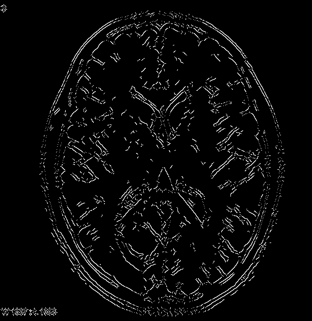
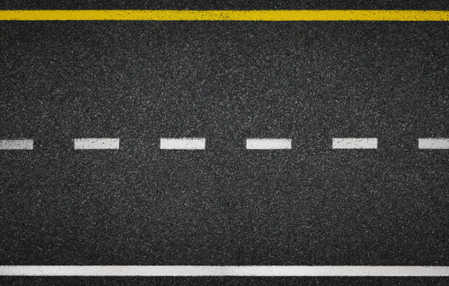
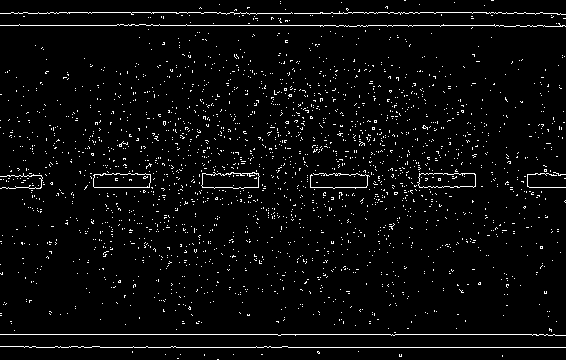
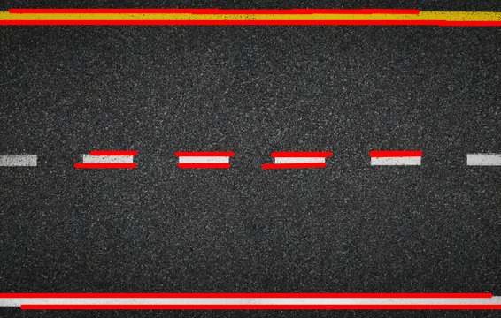
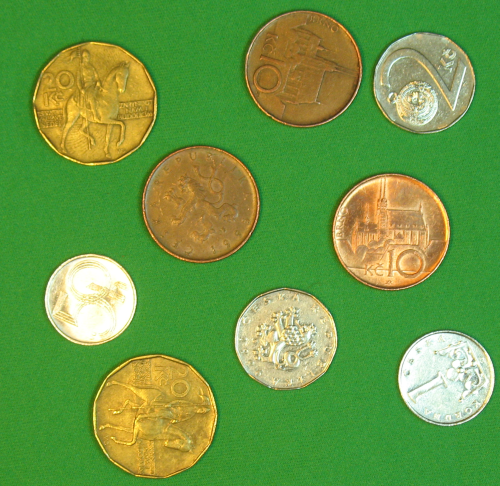
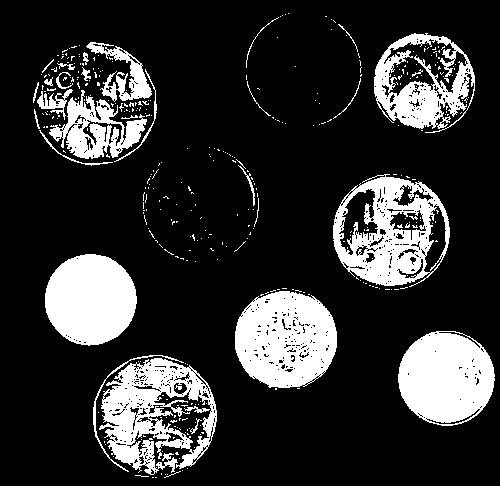
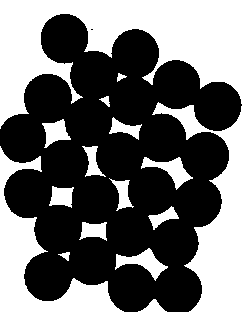
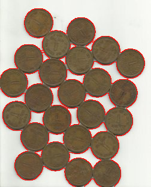

## Funtamentals of image segmentation 
Let R represent the entire spatial region occupied by an image. We may view image
segmentation as a process that partitions R into n subregions, the segmentation process can be based on **discontinuity or similarity**.

* **The content and concepts presented in this document are based on or directly adapted from the textbook Digital Image Processing by Rafael C. Gonzalez and Richard E. Woods**
---
### Similarity or Region-based segmentation

*about the similarity* we have the region-base segmentation as it follows; $R_{1}, R_{2},..., R_{n}$ such
that: 

(a) 

$$ \bigcup_{i=1}^{n} R_i = R. $$

(b)  

$$ R_i, \text{is a connected set, for}\space  i = 0, 1, 2, \ldots, n $$

(c)  

$$ R_i \cap R_j = \varnothing \quad \text{For all } i \text{and } j, \, i \ne j. $$

(d) 

$$ Q(R_i) = \text{TRUE} \quad \text{for } i = 0, 1, 2, \ldots, n $$

(e)  

$$ Q(R_i \cup R_j) = \text{FALSE} \quad \text{For any adjacent regions } R_i \text{ and } R_j. $$

* If the set formed by the union of two
regions is not connected, the regions are said to **disjoint**.

Condition **(a)** indicates that the segmentation must be complete, in the sense that **every pixel must be in a region**. 

Condition **(b)** requires that **points in a region be connected in some predefined sense** (e.g., the points must be 8-connected). 

Condition **(c)** says that **the regions must be disjoint.** 

Condition **(d)** deals with the properties that must be satisfied by the pixels in a segmented region for example, $Q(R_{i}) = TRUE$
if all pixels in $R_{i}$ have the same intensity. 

Finally, condition **(e)** indicates that **two adjacent regions $R_{i}$ and $R_{j}$ must be different in the sense of predicate** Q.† (Transpose)

* **VERY IMPORTANT DEFINITION**: The **logical predicate Q** is an homogeneous rule that defines what makes the pixels in a region similar based on similarities criteria such as " All the pixels in $R_{i}$ must have the same intensity value " 

---
### Discontinuity or Edge-base segmentation 
This type of segmentation follows implement a detection based on local discontinuities on an image.

Prior to that we need to introduce the types of discontinuities we can have in an image. The three types of image characteristics in which we are interested are isolated points, lines, and edges.

* **Edge** pixels are pixels at which
the intensity of an image changes abruptly.
* A **line** may be viewed as a (typically) thin edge segment in which the intensity of the background on either side of the line is either much higher or much lower than the intensity of the line
pixels.
* An **isolated point** may be viewed as a foreground (background) pixel surrounded by background (foreground) pixels. 

$ \rightarrow $ It is intuitive that **abrupt, local changes in intensity can be detected using derivatives.** For reasons that will become evident shortly, first- and
second-order derivatives are particularly well suited for this purpose.

In what follows, we compute *intensity differences* using just a few terms of the Taylor
series. For first-order derivatives we use only the linear terms, and we can form differences in
one of three ways.

---

**The forward difference**:

$$
\frac{\partial f(x)}{\partial x} = f'(x) = f(x + 1) - f(x)
$$
 
**The backward difference** :

$$
\frac{\partial f(x)}{\partial x} = f'(x) = f(x) - f(x - 1)
$$

**the central difference** :

$$
\frac{\partial f(x)}{\partial x} = f'(x) = \frac{f(x + 1) - f(x - 1)}{2}
$$

**The second order derivative** based on a central difference,  
$\dfrac{\partial^2 f(x)}{\partial x^2}$, is obtained by:

$$
\frac{\partial^2 f(x)}{\partial x^2} = f''(x) = f(x + 1) - 2f(x) + f(x - 1)
$$

**Points are detected based on the Laplacian:**

$$
\nabla^2 f(x, y) = \frac{\partial^2 f(x, y)}{\partial x^2} + \frac{\partial^2 f(x, y)}{\partial y^2}
$$

$$
\nabla^2 f(x, y) = f(x+1, y) + f(x-1, y) + f(x, y+1) + f(x, y-1) - 4f(x, y)
$$

---
$ \rightarrow $ **Conclusion**: In summary, we arrive at the following conclusions: 

(1) **First-order derivatives generally produce thicker edges**. 

(2) Second-order derivatives have a **stronger response to
fine detail, such as thin lines, isolated points, and noise**. 

(3) Second-order derivatives produce a double-edge response at ramp and step transitions in intensity. 

(4) The **sign of the second derivative** can be used to determine whether a **transition into** an edge is from** light to dark or dark to light.**

To find derivatives we scan the image using a mask: The approach of choice for computing first and second derivatives at every pixel location in an image is to use spatial convolution. For the 3x3 filter kernel, the procedure is to compute the sum of products of the kernel coefficients with the intensity values in the region encompassed by the kernel

$$
Z = w_1 z_1 + w_2 z_2 + \dots + w_9 z_9 = \sum_{k=1}^{9} w_k z_k
$$

Considering the original image: 


###  **Point** Extraction kernels

These masks can be implemented as follows:

```python
A = [
    [ 0,  1,  0],
    [ 1, -4,  1],
    [ 0,  1,  0]
]

B = [
    [ 1,  1,  1],
    [ 1, -8,  1],
    [ 1,  1,  1]
]

C = [
    [ 0, -1,  0],
    [-1,  4, -1],
    [ 0, -1,  0]
]

D = [
    [-1, -1, -1],
    [-1,  8, -1],
    [-1, -1, -1]
]

```
**Descriptions:**
- (a) Filter mask used to implement.  
- (b) Mask used to implement an extension of this equation that includes the diagonal terms.  
- (c) and (d) Two other implementations of the Laplacian found frequently in practice.

### **Line** detection kernels  

Detection angles are with respect to the axis system,  
with positive angles measured counterclockwise with respect to the (vertical) *x*-axis.

```python
horizontal = [
    [-1, -1, -1],
    [ 2,  2,  2],
    [-1, -1, -1]
]

45_positive = [
    [ 2, -1, -1],
    [-1,  2, -1],
    [-1, -1,  2]
]

vertical = [
    [-1,  2, -1],
    [-1,  2, -1],
    [-1,  2, -1]
]

45_negative = [
    [-1, -1,  2],
    [-1,  2, -1],
    [ 2, -1, -1]
]
```
```python
#Laplacian kernel
        Hline_detection_kernel = np.array([[-1, -1, -1],
                                            [2, 2, 2],
                                           [-1, -1, -1]])

        Vline_detection_kernel = np.array([[-1, 2, -1],
                                           [-1, 2, -1],
                                           [-1, 2, -1]])
```

Example 1 - Horizontal line kernel extraction :


Example 2 - Vertical line kernel extraction :


### Image gradient

The tool of choice for finding edge strength *and* direction at an arbitrary location $(x, y)$ of an image, $f$, is the *gradient*, denoted by $\nabla f$ and defined as the vector

$$ \nabla f(x, y) = \text{grad}[f(x, y)] = \begin{bmatrix} g_x(x, y) \\ g_y(x, y) \end{bmatrix} = \begin{bmatrix} \frac{\partial f(x, y)}{\partial x} \\ \frac{\partial f(x, y)}{\partial y} \end{bmatrix} $$

Digital aproximation of firs order partial derivatives:

$$ \begin{bmatrix} g_x(x, y) \\ g_y(x, y) \end{bmatrix} = \begin{bmatrix} \frac{\partial f(x, y)}{\partial x} \\ \frac{\partial f(x, y)}{\partial y} \end{bmatrix} = \begin{bmatrix} f(x + 1, y) - f(x,y) \\ f(x, y + 1) - f(x,y)     \end{bmatrix} $$


When evaluated for all applicable values of $x$ and $y$, $\nabla f(x, y)$ becomes a *vector image*, each element of which is a vector. The *magnitude*, $M(x, y)$, of this gradient vector at a point $(x, y)$ is given by its Euclidean vector norm: $$ M(x, y) = \|\nabla f(x, y)\| = \sqrt{g_x^2(x, y) + g_y^2(x, y)} $$

* IMPORTANT NOTE : A standard grayscale image can only display one value (a scalar) for each pixels intensity, from black to white. We can't directly plot the 2D vector $[g_x, g_y]$ or the complex number $R + jI$(Fourier for example) as a single, intuitive intensity value. **Therefore, the most common and visually informative way to "see" the result is to plot its magnitude**. **When we plot the gradient magnitude ($M$), we are visualizing the edge strength. Bright areas in this "gradient image" correspond to strong edges in the original image.**


The *direction* of the gradient vector at a point $(x, y)$ is given by

$$
\alpha(x, y) = \tan^{-1}\left[\frac{g_y(x, y)}{g_x(x, y)}\right] 
$$

Angles are measured in the counterclockwise direction with respect to the $x$-axis. This is also an image of the same size as $f$, created by the elementwise division of $g_y$ and $g_x$ over all applicable values of $x$ and $y$. 

## Steps for edge detection

Since the derivatives are sensitive to noise and there are noisy images that we cannot detect easily there are three steps to perfom **edge detection**:

1. **Image smoothing** for noise reduction(Low-pass filters such as median blur are useful here).
2. **Detection of edge points.** This is a local operation that extracts from an image all points that are potential edge-point candidates(Gradient $\nabla$).
3. **Edge localization.** The objective of this step is to select from the candidate points only the points that are members of the set of points comprising an edge.

---

# Roberts, Prewit and Sobel masks

Roberts, Prewitt, and Sobel are the most common gradient operators. They are simply small convolution masks (or kernels) designed to approximate the partial derivatives $g_x$ and $g_y$ at every pixel in an image.

## Roberts Cross Operator

This is the simplest and earliest operator. It uses 2x2 masks to approximate the gradient, but it does so on the diagonals. 
* $g_x$ mask:
```python
roberts_gx = [
    [1,  0],
    [0, -1]
] 
```

* $g_y$ mask:
```python
roberts_gy = [
    [ 0, 1],
    [-1, 0]
]
```
* Pros: Very simple and fast to compute.
* Cons: High Noise Sensitivity: Its small size makes it extremely sensitive to noise. Not Centered: A 2x2 mask isn't centered on a specific pixel, so the resulting gradient is offset by half a pixel, which is awkward. It's rarely used in modern applications.

## Prewitt Operator
The Prewitt operator improves on Roberts by using a 3x3 mask, which is centered on a pixel. It calculates the difference between the columns or rows.

* $g_x$ mask:

```Python

prewitt_gx = [
    [-1, 0, 1],
    [-1, 0, 1],
    [-1, 0, 1]
]
```
* $g_y$ mask:

```Python

prewitt_gy = [
    [-1, -1, -1],
    [ 0,  0,  0],
    [ 1,  1,  1]
]
```

* Pros: Simple to understand. It's a "central difference" operator for $g_x$ (column 3 - column 1) and averages this difference across three rows, which provides a small amount of noise reduction.

* Cons: It gives equal importance to all pixels in the neighborhood, making it still quite sensitive to noise.

## Sobel Operator

This is the most popular and widely used operator. It's a refinement of the Prewitt operator that provides **better noise suppression**.The key difference is that it gives more weight (a value of 2) to the pixels in the center row (for $g_x$) or center column (for $g_y$). 

* $g_x$ mask:
```Python
sobel_gx = [
    [-1, 0, 1],
    [-2, 0, 2],
    [-1, 0, 1]
]
```
* $g_y$ mask :
```Python 
sobel_gy = [
    [-1, -2, -1],
    [ 0,  0,  0],
    [ 1,  2,  1]
]
```
* Pros: The weighting provides a better approximation of the gradient and, crucially, performs a more effective smoothing. By emphasizing the center pixels, it's more robust to noise than the Prewitt operator.

* Cons: None, really. It's the industry standard for a basic gradient calculation.


## How to Use Them 

1. Take your original image f.

2. Calculate $G_x$: 
    Convolve f with the sobel_gx mask. This gives you a new image, $G_x$, where each pixel value is the $g_x$ component of the gradient.

3. Calculate $G_y$: 
    Convolve f with the sobel_gy mask. This gives you a second image, $G_y$.

4. Calculate Magnitude M: As defined ealier, combine these two images, pixel by pixel, to get the gradient magnitude: $$ M(x, y) = \|\nabla f(x, y)\| = \sqrt{g_x^2(x, y) + g_y^2(x, y)} $$ This final image, M, is the "gradient image" you can plot. Its bright pixels show where the edges are strong.

### Example application 

* Original image:


* After applied the sobel mask:


---


# The Marr-Hildreth Edge detector
The Marr-Hildreth algorithm, proposed by David Marr and Ellen Hildreth, is an edge detector based on two primary concepts:

1. Scale: Intensity changes occur at different scales (i.e., edges can be sharp or blurred), so an edge detector should be able to operate at different sizes.

2. Zero-Crossings: An abrupt intensity change (an edge) corresponds to a peak in the first-order derivative or, equivalently, a zero-crossing in the second-order derivative.

These ideas suggest that an operator used for edge detection should have two
salient features. First and foremost, it should be a d**ifferential operator capable of
computing a digital approximation of the first or second derivative at every point in
the image**. Second, **it should be capable of being “tuned” to act at any desired scale** (**Thresholding**),
so that large operators can be used to detect blurry edges and small operators to
detect sharply focused fine detail.

## Laplacian of Gaussian (LoG)

The fundamental problem is that the second-order derivative (like the standard Laplacian) is extremely sensitive to noise. The Marr-Hildreth solution is:

1.  **Smooth First:** Apply a **Gaussian filter ($G$)** to reduce noise and details smaller than the scale of interest.
2.  **Detect Second:** Apply the **Laplacian ($\nabla^2$)** to the smoothed image to find the zero-crossings.

The ideal operator, they argued, combines both steps into a single operator: the **Laplacian of Gaussian (LoG)**.

The 2D Gaussian function is: $$ G(x,y) = e^{-\frac{x^{2}+y^{2}}{2\sigma^{2}}} \quad \text{} $$

The LoG operator is the second derivative (Laplacian) of this function: $$ \nabla^{2}G(x,y) = \left(\frac{x^{2}+y^{2}-2\sigma^{2}}{\sigma^{4}}\right)e^{-\frac{x^{2}+y{2}}{2\sigma^{2}}} \quad$$

A 5x5 mask approximation is commonly used:

```python
LoG_kernel = [
    [ 0,  0, -1,  0,  0],
    [ 0, -1, -2, -1,  0],
    [-1, -2, 16, -2, -1],
    [ 0, -1, -2, -1,  0],
    [ 0,  0, -1,  0,  0]
] 
```

* The standard deviation, $\sigma$, of the Gaussian controls the degree of smoothing. A **small $\sigma$ smooths very little, detecting fine, sharp edges (and more noise).A large $\sigma$ smooths heavily, removing noise and fine details, and detects only large, "blurrier" edges**.

## Finding Zero-Crossings
In a discrete (pixel) image, a zero-crossing is not a pixel with the exact value 0. Instead, it is detected by looking for a sign change between adjacent pixels.
The process is:
1. Scan the LoG-filtered image, pixel by pixel.

2. At each pixel, check its neighbors (e.g., the 4- or 8-neighbors).

3. If any neighbor has an opposite sign (one is positive, one is negative), a zero-crossing has occurred, and this pixel is marked as an edge.

This simple check often produces many weak, noisy edges. **To fix this, a threshold is applied. An edge is only marked if the difference between the positive and negative pixels is greater than the threshold.** This eliminates weak zero-crossings , resulting in thinner, cleaner edges.

## The Algorithm (Step-by-Step)

1. Filter the image with an n×n Gaussian lowpass filter. The size n is chosen based on σ.

2. Compute the Laplacian of the filtered image.
* Note: Due to convolution properties, you can also convolve the image directly with a single LoG filter: $$g(x,y)=[\nabla^{2}G(x,y)]*f(x,y)$$ (the 5x5 matrix aproximation said before).
3. Find the zero-crossings of the resulting image to identify the edges.


## Results of Marr-Hildreth implementation 
Using this parameters: 
``` python
marr_hildreth_image = seg.marr_hildreth(
            gaussian_ksize=5, 
            st_deviant=1.4, 
            threshold=2.0,
            use_kernel_aproximation=False 
        )
```


---
# Canny Edge detector 
**Canny algorithm is more complex than the others but more eficient in detecting edges.**
Canny`s main goals:
1. *Low error rate*. All edges should be found, and there should be no spurious responses. 
2. *Edge points should be well localized*. The edges located must be as close as possible to the true edges. That is, the distance between a point marked as an edge by the detector and the center of the true edge should be minimum. 
3. *Single edge point response.* The detector should return only one point for each true edge point. That is, the number of local maxima around the true edge should be minimum. This means that the detector should not identify multiple edge pixels where only a single edge point exists.

It's a multi-stage algorithm that excels because it's designed to be **robust to noise while providing clean, thin, and continuous lines**. It achieves this by focusing on three key objectives: finding real edges (low error rate), locating them precisely, and marking them with a single-pixel response.

## 1- Noise reduction 
The first step is to **convolve the input image with a Gaussian filter**. This slightly blurs the image, smoothing out minor noise fluctuations before the gradient is calculated. The amount of blur (controlled by the filter's $\sigma$, or sigma) is the primary parameter you tune: **a larger $\sigma$ reduces more noise but can make it harder to detect faint edges**.

Canny`s led to the conclusion that **a good approximation to the optimal step edge detector is the first derivative of a Gaussian:** $$\frac{d}{dx} e^{-\frac{x^2}{2\sigma^2}} = \frac{-x}{\sigma^2} e^{-\frac{x^2}{2\sigma^2}}$$ 

Let $f(x, y)$ denote the input image and $G(x, y)$ denote the Gaussian function:

$$
G(x, y) = e^{-\frac{x^2+y^2}{2\sigma^2}}
$$

We form a smoothed image, $f_s(x, y)$, by convolving $f$ and $G$:

$$
f_s(x, y) = G(x, y) \star f(x, y)
$$
* If using openCV we can just apply: 
```python
blurred_img = cv2.GaussianBlur(img, (5, 5), 0)
```

## 2 - Finding Gradient Intensity and Direction
The algorithm **calculates the gradient of the smoothed image and computes it`s magnitude and direction**. This is typically done using 3x3 Sobel operators to get the horizontal ($g_x$) and vertical ($g_y$) derivatives.
$$ M_s(x, y) = \|\nabla f_s(x, y)\| = \sqrt{g_s^2(x, y) + g_s^2(x, y)}$$

and

$$\alpha(x, y) = \tan^{-1}\left[\frac{g_y(x, y)}{g_x(x, y)}\right]$$

with $g_s(x, y)$ and $g_y(x, y)$. Any of the derivative filter kernel pairs  can be used to obtain $g_s(x, y)$ and $g_y(x, y)$. The convolution of image with a gaussian filter is implemented using an $n \times n$ Gaussian kernel with size = k_size. Keep in mind that $\|\nabla f_s(x, y)\|$ and $\alpha(x, y)$ are arrays of the same size as the image from which they are computed.

This can be done by: 
``` python
sobel_gx = np.array([[-1, 0, 1], 
                     [-2, 0, 2], 
                     [-1, 0, 1]], dtype=np.float64)

sobel_gy = np.array([[-1, -2, -1], 
                     [ 0,  0,  0], 
                     [ 1,  2,  1]], dtype=np.float64)

#Convolve the smoothed image with sobel kernels
gs_image_x = self.convolve(fs_smoothed_image, sobel_gx)

gs_image_y = self.convolve(fs_smoothed_image, sobel_gy)

#Get the magnitude and angle
magnitude = np.sqrt(np.square(gs_image_x) + np.square(gs_image_y))

angle = np.arctan2(gs_image_y, gs_image_x)
```

## 3 - Non-Maxima Suppression (NMS)
As long as the ramp is sloping, the gradient will have a high value. **This means all the pixels along that sloping ramp will have a high magnitude, creating a "thick" or "wide ridge" of high-intensity pixels in the gradient magnitude image**. 

Gradient image $\|\nabla f_s(x, y)\|$ typically contains wide ridges around local maxima. The next step is to thin those ridges. One approach is to use **nonmaxima suppression**.

The nonmaxima suppression iterates through every pixel in the magnitude image:

1. It looks up the pixel's gradient angle (e.g., 22.8°).

2. It rounds this angle to the nearest 45° (e.g., horizontal, vertical, or one of the two diagonals).

3. It compares the pixel's magnitude to the two neighbors that lie along that gradient direction.

4. If the pixel's magnitude is not the local maximum (i.e., if either of its two neighbors is stronger), the pixel is suppressed (set to 0).

5. The result is an image containing only "ridge lines" where the edge strength is highest, creating clean, 1-pixel-thick edges. 

Or in python: 
```python
angle_deg = np.rad2deg(angle_rad)

nms_image = np.zeros_like(magnitude, dtype=np.float64)

for i in range(1, self.height - 1):
    for j in range(1, self.width - 1):
                
        M = magnitude[i, j]
        A_deg = angle_deg[i, j]
        
        #---Rounds the angle---
        
        #Horizontal
        
        if (-22.5 <= A_deg <= 22.5) or (A_deg <= -157.5) or (A_deg >= 157.5):
            n1 = magnitude[i - 1, j]
            n2 = magnitude[i + 1, j] 
        
        #+45° 
        elif (22.5 <= A_deg <= 67.5) or (-157.5 <= A_deg <= -112.5):
            n1 = magnitude[i - 1, j - 1] 
            n2 = magnitude[i + 1, j + 1] 

        # Vertical 
        elif (67.5 <= A_deg <= 112.5) or (-112.5 <= A_deg <= -67.5):
            n1 = magnitude[i, j - 1] 
            n2 = magnitude[i, j + 1] 
        
        #-45° 
        elif (112.5 <= A_deg <= 157.5) or (-67.5 <= A_deg <= -22.5):
            n1 = magnitude[i - 1, j + 1] 
            n2 = magnitude[i + 1, j - 1] 
        
        # If M is an local maxima
        if (M >= n1) and (M >= n2):
            nms_image[i, j] = M
        
        return nms_image
```

## 3 - Hysteresis Thresholding (Edge Linking)
This stage decides which are all edges are really edges and which are not. For this, we need two threshold values, minVal and maxVal. Any edges with intensity gradient more than maxVal are sure to be edges and those below minVal are sure to be non-edges, so discarded.
* (In Marr-Hildreth) If we set the threshold too low, there will still
be some false edges (called false positives). If the threshold is set too high, then valid edge points will be eliminated (false negatives).
* Canny’s algorithm attempts to improve on this situation by using hysteresis thresholding 
1. Find Strong Edges: Any pixel in the NMS image with a magnitude above the High Threshold is immediately marked as a "strong" edge. These are definitively part of the final output.

2. Find Weak Edges: Any pixel with a magnitude between the Low Threshold and the High Threshold is marked as a "weak" edge.

3. Filter & Link: The algorithm performs a connectivity analysis:

4. If a "weak" pixel is connected to a "strong" pixel (directly or via a chain of other weak pixels), it is kept and promoted to a "strong" edge.

5. If a "weak" pixel is isolated (not connected to any strong edge), it is discarded as noise.
### How the Hysteresis thresholding works

We can visualize the thresholding operation as creating two additional images:

$$
g_{NH}(x, y) = g_N(x, y) \ge T_H 
$$

and

$$
g_{NL}(x, y) = g_N(x, y) \ge T_L 
$$

Initially, $g_{NH}(x, y)$ and $g_{NL}(x, y)$ are set to 0. After thresholding, $g_{NH}(x, y)$ will usually have fewer nonzero pixels than $g_{NL}(x, y)$, but all the nonzero pixels in $g_{NH}(x, y)$ will be contained in $g_{NL}(x, y)$ because the latter image is formed with a lower threshold. We eliminate from $g_{NL}(x, y)$ all the nonzero pixels from $g_{NH}(x, y)$ by letting

$$
g_{NL}(x, y) = g_{NL}(x, y) - g_{NH}(x, y) 
$$

**The nonzero pixels in $g_{NH}(x, y)$ and $g_{NL}(x, y)$ may be viewed as being “strong” and “weak” edge pixels, respectively**. After the thresholding operations, **all strong pixels in $g_{NH}(x, y)$ are assumed to be valid edge pixels, and are so marked immediately.** Depending on the value of $T_H$, the edges in $g_{NH}(x, y)$ typically have gaps. Longer edges are formed using the following procedure:

**(a)** Locate the next unvisited edge pixel, $p$, in $g_{NH}(x, y)$.

**(b)** Mark as valid edge pixels all the weak pixels in $g_{NL}(x, y)$ that are connected to $p$ using, say, 8-connectivity.

**(c)** If all nonzero pixels in $g_{NH}(x, y)$ have been visited go to Step (d). Else, return to Step (a).

**(d)** Set to zero all pixels in $g_{NL}(x, y)$ that were not marked as valid edge pixels.

At the end of this procedure, the final image output by the Canny algorithm is formed by appending to $g_{NH}(x, y)$ all the nonzero pixels from $g_{NL}(x, y)$.


Or in python: 
```python
edges_image = np.zeros_like(nms_image, dtype=np.uint8)

# 1. Classify strong and weak pixels
strong_pixels = []
weak_pixels = {} # Use a dict (hash map) for fast lookup of weak pixels

for i in range(self.height):
    for j in range(self.width):
        mag = nms_image[i, j]
        if mag >= high_thresh:
            edges_image[i, j] = 255  # Mark strong pixels
            strong_pixels.append((i, j)) # Add to stack
        elif mag >= low_thresh:
            weak_pixels[(i, j)] = True # Mark as weak

# Start stack with all strong pixels
stack = strong_pixels

while stack:
    r, c = stack.pop()
    
    # Check 8 neighbors
    for dr in [-1, 0, 1]:
        for dc in [-1, 0, 1]:
            if dr == 0 and dc == 0:
                continue 
            
            nr, nc = r + dr, c + dc
            
            # Check bounds
            if 0 <= nr < self.height and 0 <= nc < self.width:
                # Check if this neighbor is a weak pixel
                if (nr, nc) in weak_pixels:
                    # Promote it to an edge
                    edges_image[nr, nc] = 255
                    # Remove from weak_pixels to avoid re-processing
                    del weak_pixels[(nr, nc)]
                    # Add it to the stack to check its neighbors
                    stack.append((nr, nc))

# All remaining pixels in edges_image are 0 (suppressed)
return edges_image

```

## Results of implementation vs OpenCv 
Original image: 


My Canny`s algorithm implementation with params:
```python
 canny_image = seg.canny_edge(k_size=5, 
                                     sigma=1.0, 
                                     high_threshold=90,
                                     low_threshold=30
                                )
```



OpenCV Canny`s algorithm implementation with params:
```python 
canny_image_opencv = cv.Canny(original_image, 100, 40)
```
 


* NOTE: It's clear that OpenCV's implementation is significantly faster. However, this implementation provides a clear view of the underlying algorithm and although the OpenCV version is more performant, my implementation correctly models the algorithm and achieves a good response with proper parameter tuning.
---
# Hough transform

The Hough Transform is a robust feature extraction technique used in digital image processing to detect shapes that can be represented by a parametric equation (e.g., lines, circles, ellipses). Its primary strength is its ability to identify these shapes even when they are partially occluded, broken, or obscured by noise in an image.

**The core principle is to convert a difficult pattern-finding problem in the Image Space into a simpler peak-finding problem in a Parameter Space.**

### Core problem
After an edge detection step (such as the Canny edge detector), an image is reduced to a set of binary edge pixels (points). The human visual system can easily perceive lines or curves in this "cloud of points," but for a computer, this is challenging. **A brute-force method of checking all combinations of points to find lines is computationally infeasible.** So Hough uses a clever "voting" process based on a duality between the image space and a parameter space: 
1. Image Space: The standard $(x,y)$ coordinate system of the image. A line is a collection of points. A point is a single $(x,y)$ coordinate.

2. Parameter Space: An abstract space where the axes are the parameters that define the shape. For a line, this could be slope $m$ and y-intercept $c$ from the equation $y=mx+c$.

So a line in image space (defined by one $m$ and one $c$) maps to a single point $(m, c)$ in the parameter space and a point $(x_1, y_1)$ in image space maps to a line in the parameter space. This is because a single point $(x_1, y_1)$ can be part of an infinite family of lines. 
Rearranging the line equation to $$c = -x_1m + y_1$$ shows that this is a line in the $(m, c)$ plane.

* The $y = mx + c$ parameterization **has a critical flaw: a vertical line.** For a vertical line, the slope $m$ is infinite, which makes the parameter space unbounded and computationally impossible to represent.

Because of that the Hough transform uses the polar representation of line: $$\rho = x \cos(\theta) + y \sin(\theta)$$
Where: 
* $\rho$ (rho) is the perpendicular distance from the origin $(0, 0)$ to the line.
* $\theta$ (theta) is the angle of the perpendicular (normal) vector with respect to the x-axis.

This parameterization is powerful because its parameter space $(\rho, \theta)$ is bounded. $\theta$ can be constrained (e.g., $0^\circ$ to $180^\circ$) and $\rho$ is constrained by the image's diagonal. It can represent any line, including vertical ones.

## Hough algorithm


The Hough Transform algorithm is essentially a voting process where each edge pixel "votes" for all possible lines it could belong to.
1. Initialize the Accumulator : An accumulator array (a 2D histogram) is created to represent the $(\rho, \theta)$ parameter space. The axes are discretized into bins (e.g., 1-degree steps for $\theta$, 1-pixel steps for $\rho$). All bins are initialized to zero. This array acts as the "ballot box"

2. Perform Edge Detection: A binary edge-detected image (e.g., from Canny or Marr-Hildreth) is required as input.

3. Cast Votes: The algorithm iterates through every edge pixel $(x, y)$ in the binary image and for each edge pixel $(x, y)$: The algorithm iterates through all possible values of $\theta$ (e.g., $0^\circ, 1^\circ, 2^\circ, ... 180^\circ$). For each $\theta$, it calculates the corresponding $\rho$ using the equation: $$\rho = x \cos(\theta) + y \sin(\theta)$$
This $(\rho, \theta)$ pair represents one possible line that passes through the point $(x, y)$. The algorithm "casts a vote" by incrementing the value of the corresponding bin in the accumulator array: 
``` python 
accumulator[rho, theta] += 1.
```
Geometrically, each edge point $(x, y)$ maps to a sinusoidal curve in the $(\rho, \theta)$ space.

4. Find the Peaks: After all edge pixels have voted, the algorithm analyzes the accumulator array. Collinear points in the image space (which all lie on the same line, $\rho_{line}, \theta_{line}$) will produce sinusoids that all intersect at a single point $(\rho_{line}, \theta_{line})$ in the parameter space. This intersection results in a "peak" (a bin with a high vote count) in the accumulator. By setting a threshold (a minimum number of votes), the algorithm can find these peaks. Each peak above the threshold corresponds to a detected line in the original image.

### The Hough algorithm can be extended to other shapes 
This same concept can be extended to any shape defined by parameters.
* Shape: Circle
* Equation: $(x - a)^2 + (y - b)^2 = r^2$
* Parameters: $(a, b, r)$ — the center coordinates $(a, b)$ and the radius $r$.
* Accumulator: This requires a 3-dimensional accumulator array. 
```python
accumulator[a, b, r]
```
For each edge pixel $(x, y)$, it will "vote" for all 
possible circles (all $a, b, r$) that it could lie on. 
This is computationally more intensive than line detection but follows the same core principle of mapping from image space to a parameter voting space.

## Results using openCV
Original image: 



Canny image obtained with openCV



Hough lines



---
# Similiarity Based aproach

These Methods/Algorithms are based on similarities instead of discontinuities: this means we will **discuss techniques for partitioning images directly into regions based on intensity values and/or properties of these values.**

# Thresholding with Otsu method
Otsu's method is a fully automatic, data-driven algorithm **used to find the optimal global threshold for a grayscale image.**

Its goal is to take a grayscale image and convert it into a binary (black and white) image. The main problem it solves is answering the question: "How do you pick the best threshold value t without manual tuning or guesswork?"

## Maximizing Separability

Otsu's method treats the image's pixel intensities as a 1D clustering problem. It makes a fundamental assumption: the image is composed of two distinct classes (clusters) of pixels:

Class 0 (Background): A cluster of darker pixels.

Class 1 (Foreground): A cluster of lighter pixels.

The "optimal" threshold t is the one that best separates these two clusters.

Otsu defines "best" in a statistical way: The best threshold t is the one that maximizes the "between-class variance" ($\sigma_B^2$). In simple terms, it's the split point that pushes the average intensity of the background group as far away as possible from the average intensity of the foreground group.

## The Algorithm (Step-by-Step)

Instead of processing the M x N image, Otsu's method is fast because it only processes the 256-bin image histogram.

1. Compute Histogram: Generate the 256-bin histogram of the entire image.

2. Normalize Histogram: Divide the count in each bin by the total number of pixels. This gives you a probability distribution, $p_i$, where $p_i$ is the probability that a randomly chosen pixel has intensity i.

3. Iterate and Evaluate: Loop through all possible thresholds t from 0 to 255.

4.  For each t, split the histogram into two classes:

    * Class 0 (Background): Pixels with intensity $[0, ..., t]$
    * Class 1 (Foreground): Pixels with intensity $[t+1, ..., 255]$

5. Calculate Key Metrics for this split t:

    * Weights (Probabilities): The probability a random pixel will fall into each class.

    $w_0(t) = \sum_{i=0}^{t} p_i$

    $w_1(t) = \sum_{i=t+1}^{255} p_i$

    * Means: The average intensity value for each class.

    $\mu_0(t) = \frac{\sum_{i=0}^{t} i \cdot p_i}{w_0(t)}$

    $\mu_1(t) = \frac{\sum_{i=t+1}^{255} i \cdot p_i}{w_1(t)}$

6. Calculate the Objective Function:
    * Compute the Between-Class Variance ($\sigma_B^2$) for this t. This is the value you want to maximize.

    $$\sigma_B^2(t) = w_0(t) \cdot w_1(t) \cdot (\mu_1(t) - \mu_0(t))^2$$

This formula is high when the two classes are "balanced" (the $w_0 \cdot w_1$ term) and their means are very far apart (the $(\mu_1 - \mu_0)^2$ term).

7. Find the Maximum:
    * The t that produces the maximum $\sigma_B^2(t)$ value is the final, optimal Otsu threshold.

### Assumptions and Limitations

Otsu's method is powerful, but **it fails when its core assumption is violated** that is:
* The image's histogram is bimodal (it has two clear, distinct peaks, one for background and one for foreground).

With that being said we can stablish that Otsu's method will perform poorly when:

* The Histogram is Unimodal: If the image is all one thing (e.g., a close-up of a face, a foggy landscape), the histogram has only one peak. Otsu will still find a threshold, but it will be meaningless and likely cut the single peak in a strange place.

* Classes are Highly Unbalanced: If your foreground object is tiny (e.g., a few white stars in a black sky), its "peak" in the histogram is too small to be statistically significant. The algorithm will likely fail to find a good separation.

* Non-Uniform Illumination: This is the most common failure case. Otsu finds one global threshold for the entire image. If the image has a bright light in one corner and a deep shadow in another, no single threshold can work for both areas.

Solution: In this case, you must use an Adaptive Threshold, which calculates different thresholds for different local regions of the image.

## Results
The Otsu method choose the best value (between 0 and 255) that correctly separates all the pixels in the image in two classes:  0 for background or 1 for foreground. 
* In the coins image above we can see that the pixels that are more close to gray or darker are set as background: 





```bash
Otsu's optimal threshold: 154
```
* On the other image, we can see that the image get correctfully segmented between the elements and the background


```bash
Otsu's optimal threshold: 189
```

---

# Watershed
It is a region-based (or region-growing) algorithm, meaning it segments an image by grouping pixels into regions or "basins."

**Its primary strength and most common use case is to separate touching or overlapping objects in an image (like coins touching)** . This is a task that simple global thresholding (like Otsu's method) cannot accomplish, as thresholding will merge all "foreground" objects into a single, connected component.

The algorithm is most formally and intuitively understood by visualizing the grayscale image as a 3D topographic landscape:

* Pixel Intensity corresponds to Elevation.

* Dark Pixels (Local Minima) represent Catchment Basins or valleys.

* Bright Pixels (Local Maxima) represent Ridges or "watershed lines" that separate the basins.

Watershed is like "flooding" all valleys at the same time upwards until they meet, specifically to find the "ridges" (hills) that separate them.

## Topographic analogy
TThe algorithm is most formally and intuitively understood by visualizing a grayscale image, $f(x, y)$, as a 3D topographic landscape:

* Spatial Coordinates $(x, y)$ represent the East-West and North-South positions.

* Intensity $f(x, y)$ represents the Elevation at that position.

In this landscape:

1. Local Minima (dark pixel regions) are the "valleys" or catchment basins. These are the points from which water, if it fell on the surrounding region, would collect.

2. Local Maxima (bright pixel regions) are the "peaks" or "ridges" that separate the basins.

3. The Watershed Lines (or "dams") are the ridges that divide one catchment basin from another.

## The Algorithm 
The formal algorithm is best described by simulating the immersion of this topographic landscape into a large body of water.

1. Identify Minima: The algorithm begins by identifying all local minima (catchment basins) in the image $f(x, y)$.

2. Simulate Flooding: Imagine "holes" are punched in each local minimum. The entire landscape is then slowly immersed in water.

3. Basins Grow: As the landscape is submerged, water enters through the holes and begins to fill the catchment basins. The water from each minimum is given a unique "color" or label. As the water level rises (corresponding to processing pixels from the lowest intensity $h_{min}$ to the highest $h_{max}$), the "pools" from each basin expand.

4. Construct Dams (Watershed Lines): At some water level $h$, the water from two different basins (e.g., basin $i$ and basin $j$) will be about to merge. This "short-circuit" is prevented. A "dam" (a watershed line) is built at every location where this merging would occur. These dams are one pixel wide and are assigned a special value ( 0 or -1).

5. Final Segmentation: This process continues until the entire "landscape" (image) is flooded, from $h_{min}$ to $h_{max}$. The resulting "dams" form a set of continuous, closed boundaries. These boundaries partition the image into its constituent catchment basins (the segmented regions).

## Problem with Over-segmentation

if applied naively to a raw digital image, the watershed algorithm has one critical, well-documented flaw: over-segmentation.

* Caused by Digital images:  even after smoothing, contain a high degree of noise and minor texture variations. These variations create a massive number of spurious (false) local minima that do not correspond to the "true" objects of interest. **This causes the algorithm to be extremely sensitive and will treat every one of these spurious minima as a separate catchment basin. And because of that it produces an image with thousands of tiny, fragmented, and meaningless segmented regions, rendering the output useless.**

* Solution: To solve the over-segmentation problem, the Marker-Controlled Watershed is the standard, practical implementation. **The core idea is to modify the topographic landscape itself before flooding, such that the only local minima present are the ones we explicitly define.** These user-defined minima are called markers or "seeds."


This method is almost always run on the gradient magnitude image $g(x, y) = |\nabla f(x, y)|$ (e.g., from a Sobel operator). In this gradient image, the "ridges" (high values) correspond to the object edges, and the "valleys" (low values) represent the flat, homogeneous interiors of the objects.

## Results
Using Otsu`s method



Drawing using Watershed 




